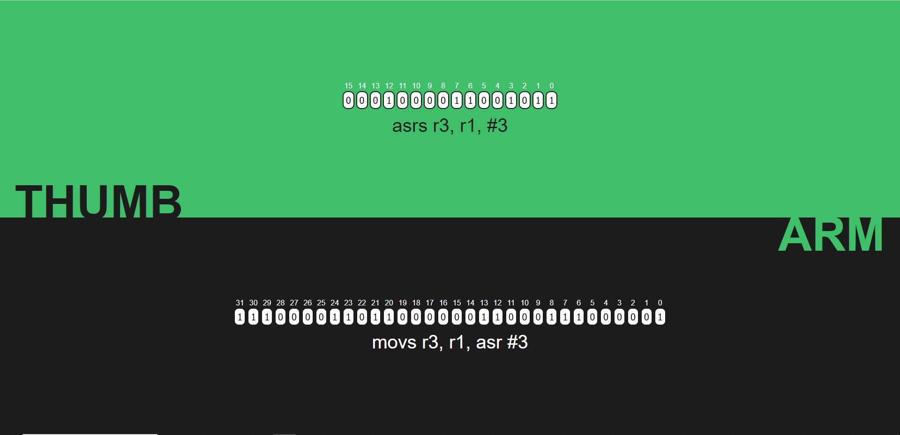
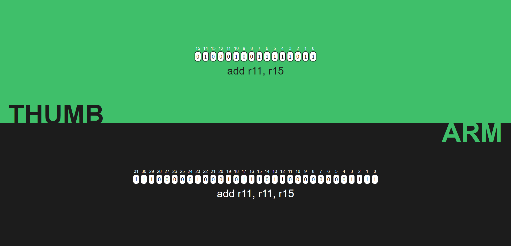
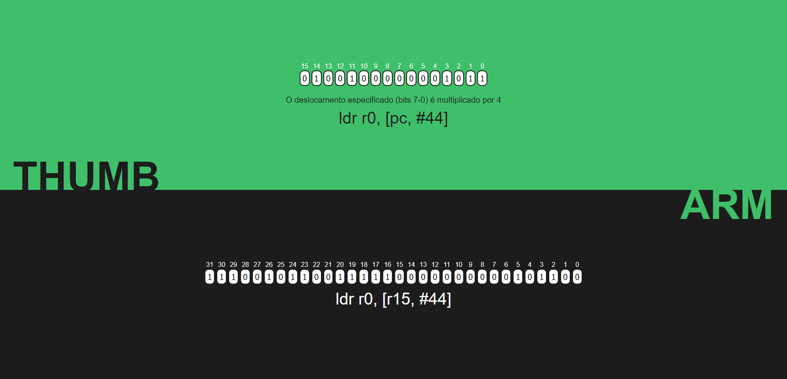
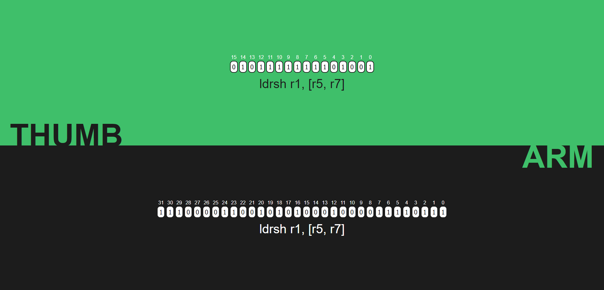
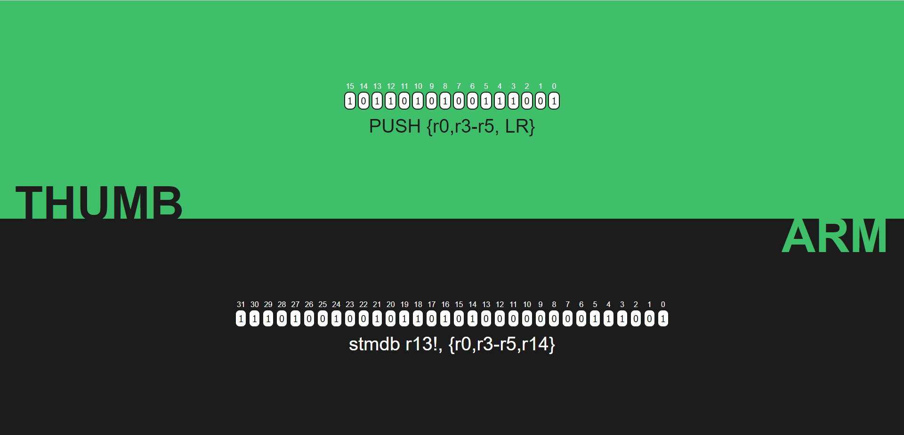
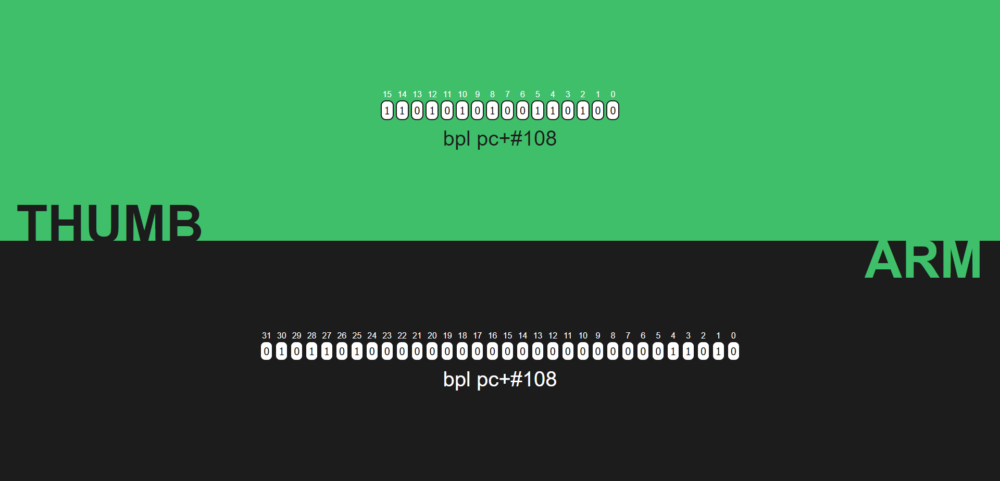

# B_LEARN

### Tabela de conteúdos

1. [Objetivo](#objetivo)
2. [Requisitos e Dependências](#requisitos-e-dependências)
3. [Execução](#execução)
4. [Exemplos](#exemplos)
5. [Integrantes](#integrantes)
6. [Agradecimentos](#agradecimentos)

## Objetivo

O objetivo do projeto B_LEARN é o desenvolvimento de um tradutor de instruções Thumb (16 bits) para ARM32 (32 bits). Para a tradução, são utilzados campos (inputs) nos quais os bits das instruções podem ser configurados, e a tradução ocorre de maneira automática.

Para isso, foram levadas em conta as instruções Thumb que possuam equivalente direto em ARM32, isto é, que gerem apenas uma instrução na ISA ARM32.

Além da visualização do bits, o projeto conta com tradutores de instruções binárias para instruções ASCII, desenvolvidos pelo [Professor Bruno Basseto](https://github.com/bru4bas)

## Requisitos e Dependências

1. WSL/Linux

    Recomenda-se que o projeto seja executada no sobre o Linux, ou sobre o WSL.

2. Node

    Para execução deste projeto, é recomendável que você tenha instalado no seu ambiente a versão estável mais recente do Node (> v18.16.1).

~~~bash
    sudo apt-get install curl
~~~
~~~bash
    curl -o- https://raw.githubusercontent.com/nvm-sh/nvm/master/install.sh | bash
    command -v nvm
~~~
~~~bash
    nvm install --lts
~~~

## Execução

### Instalando as dependências do projeto

Na pasta raiz do projeto, digite o seguinte comando para instalar as dependências do projeto:

~~~bash
    npm install
~~~

### Executando o projeto

~~~bash
    npm start
~~~

### Testes

~~~bash
    npm test
~~~

## Exemplos

Para o uso do B_LEARB, basta clicar sobre as caixas dos bits, a tradução, caso exista, ocorrerá da maneira automática.

- Operação aritmética com imediato

- Operação de deslocamento do conteúdo de um registrador

- Operação lógica entre registradores

- Operação entre registradores "altos" (Bug na tradução ASCII)

- Operação de "Load", relativa ao contador de programa

- Operação de "Load byte", com deslocamento em registrador.

- Operação de "Load half", com deslocamento imediato

- Operação "Push"

- Operação de desvio condicional, endereço atingível

- Operação de desvio incondicional, endereço não atingível*

> Endereços cujo bit 0 sejam "1" não são atingíveis por uma instrução traduzida para ARM32

## Integrantes

| Nome               | Github           |
|--------------------|------------------|
| Henrique D'Amaral  | @DamaralHenrique |
| Rafael Nakata      | @rafnak1         |
| Vinicius de Castro | @vinicius-CL     |

## Agradecimentos

Agradecimentos especiais ao [Professor Bruno Basseto](https://github.com/bru4bas), autor do tradutor de instruções binárias para instruções ASCII.
